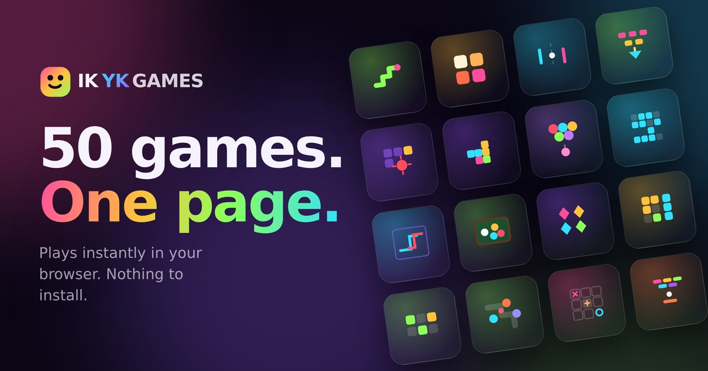

# IKYK Games

Fifty browser games in a single HTML file. No build step, no dependencies, no
network requests. Open the file and play.

**Live:** _add your Vercel URL here once deployed_

---

## What it is

One `index.html`, about 700 KB, containing fifty complete games and the shell
that runs them. There is no bundler, no framework, and no `node_modules`. The
page makes zero external requests, so it works offline and from a `file://` URL.

| Category | Games |
|---|---|
| Arcade (7) | Snake, Pong, Breakout, Shallows, Whack-a-Mole, Ghost Run, Bubble Pop |
| Action (10) | Vector Run, Platformer, Endless Runner, Sky Hop, Crossing, Turbo Lane, Drift Track, Cargo Dash, Invaders, Sky Guard |
| Puzzle (15) | 2048, Memory Match, Minesweeper, Fifteen, Stacker, Maze, Colour Chain, Gem Swap, Pipe Flow, Crate Push, Solitaire, Gridlock, Tile Match, Grid Logic, Block Fit |
| Strategy (8) | Tic-Tac-Toe, Checkers, Reversi, Dots & Boxes, Light Cycles, Battleship, Nine Boards, Line Defence |
| Skill (8) | Tower Stack, Tap Rush, Reflex, Mini Golf, Air Hockey, Buzzer Beater, Ten Pin, Pocket Pool |
| Word (2) | Wordle, Word Search |

## Running it

Download `index.html` and open it in a browser. That is the whole procedure.

## How it works

**Each game is sandboxed in its own shadow root.** Game sources live in a
`GAME_SRC` map as three strings — CSS, HTML and JS. When you open a game,
`mountGame()` builds a shadow root, injects the styles and markup, and evaluates
the JS inside a `new Function` whose `document` argument is a shim scoped to that
shadow root. A game cannot reach the page around it or another game's DOM.

The shim also records every timer, animation frame and window listener the game
registers, so closing a game tears all of them down. Without that, fifty games
sharing one page would leak intervals into each other.

**Games are laid out at a fixed design size and scaled to fit.** `measure()`
lays a game out at several candidate widths and picks the scale that best fills
the available space; `fit()` applies it as a CSS transform. That is why the same
game works on a phone and a desktop without any per-game responsive code.

**Some interesting bits inside individual games:**

- *Grid Logic* generates nonograms, then runs a line-solver over them and throws
  away any puzzle that cannot be finished by deduction. No puzzle needs a guess.
- *Pipe Flow* builds its routes with a backtracking self-avoiding walk, so the
  solution genuinely doubles back instead of running a diagonal staircase.
- *Nine Boards* plays ultimate tic-tac-toe with iterative-deepening negamax and
  alpha-beta pruning, on a time budget so the reply stays under a second.
- *Line Defence* treats armour as a flat subtraction from each individual hit
  rather than a percentage. A percentage reduction made the highest-damage tower
  best at everything; a flat bite per shot is what makes three tower types
  necessary.

## Tech notes

- Plain JavaScript throughout — functions, closures and object literals. No
  classes and no `this`.
- Canvas 2D for the real-time games, DOM for the board and card games.
- `localStorage` for high scores, wrapped so it degrades quietly when blocked.
- 708 KB raw, roughly 179 KB over the wire once gzipped.

## Development notes

This project was built with heavy AI assistance. My contribution was direction,
testing and debugging: choosing what the arcade should contain, finding the bugs,
and deciding how they should be fixed. Balance for the games with opponents
(Battleship, Light Cycles, Line Defence) was tuned by running headless
simulations of thousands of matches rather than by guessing.

## Licence

MIT — see `LICENSE`.
